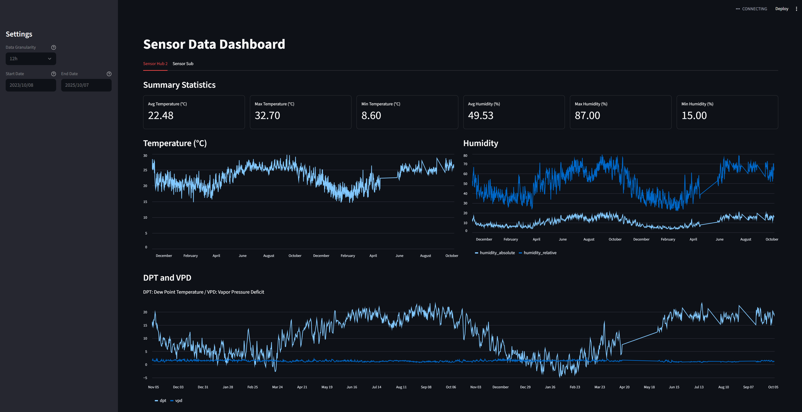

# streamlit-dashboard-sensors

A simple dashboard built with [Streamlit](https://streamlit.io/), with my room statistics (e.g., temperature, humidity) from Switchbot sensors.

Dashboard example:



## Run

```bash
uv run streamlit run app/main.py
```

## License

Apache-2.0
